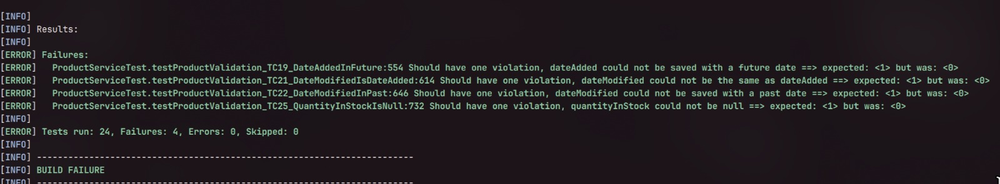

# Análise de Testes de Software - Loja Online


| Nome                              | RA      |
|------------------------------------|---------|
| Sergio Sebastian Pezo Jimenez      | 298813  |
| João Victor Costa Vaccari          | 298794  |
| Gabriel Eduardo Mangione Mamonde   | 298792  |


Este repositório contém os testes de unidade para a entidade `Product`

## Metodologia de Teste (AAA)

Os testes foram estruturados utilizando o padrão **AAA (Arrange, Act, Assert)**, uma abordagem que organiza os testes de unidade de forma clara e concisa.

-   **Arrange (Organizar):** Nesta primeira fase, todo o cenário de teste é preparado. Isso inclui a inicialização de objetos, a configuração de mocks e a definição dos dados de entrada necessários para o teste. O objetivo é criar um ambiente controlado e previsível.
-   **Act (Agir):** Na segunda fase, o método ou a funcionalidade que está sendo testada é executado. Esta é a ação principal do teste, onde o comportamento do sistema é invocado com os dados preparados na fase de *Arrange*.
-   **Assert (Verificar):** Na última fase, os resultados da ação são verificados. As asserções validam se o comportamento do sistema corresponde ao esperado, comparando os resultados obtidos com os valores esperados. Se a verificação falhar, o teste falha.

## Casos de Teste Implementados

A seguir, uma descrição detalhada de cada caso de teste implementado em `ProductServiceTest.java`, com base na análise de classes de equivalência documentada no arquivo `test_cases_coverage.html`.

### Casos de Teste Válidos

Estes testes verificam se a entidade `Product` aceita combinações de dados que são consideradas válidas de acordo com as regras de negócio.

-   **TC1 (testProductValidation\_TC1\_ValidCase):**
    -   **Objetivo:** Validar um produto com título válido no limite inferior (3 caracteres), palavras-chave nulas, descrição nula, avaliação nula, preço mínimo (1), estoque zero, status IN_STOCK, peso nulo, dimensões nulas, data de adição igual ao momento atual e data de modificação nula.
-   **TC2 (testProductValidation\_TC2\_ValidCase):**
    -   **Objetivo:** Validar um produto com título válido (mínimo dentro do intervalo), palavras-chave vazias, descrição no limite inferior (50 caracteres), avaliação mínima (1), preço > 1, estoque positivo, status OUT_OF_STOCK, peso 0, dimensões vazias, data de adição no passado e data de modificação igual ao momento atual.
-   **TC3 (testProductValidation\_TC3\_ValidCase):**
    -   **Objetivo:** Validar um produto com título próximo ao limite superior (99 caracteres), palavras-chave curtas, descrição logo acima do limite inferior (51 caracteres), avaliação intermediária (2), preço alto mas válido, estoque válido, status PREORDER, peso positivo, dimensões curtas, data de adição válida e data de modificação posterior à adição.
-   **TC4 (testProductValidation\_TC4\_ValidCase):**
    -   **Objetivo:** Validar um produto com título no limite superior (100 caracteres), palavras-chave muito longas mas válidas (até 199 caracteres), descrição válida, avaliação alta (9), preço máximo permitido (9999), estoque positivo, status DISCONTINUED, peso positivo, dimensões no limite superior (49 caracteres), data de adição válida e data de modificação posterior.
-   **TC5 (testProductValidation\_TC5\_ValidCase):**
    - **Objetivo:** Validar um produto com título válido, palavras-chave no limite (200 caracteres), descrição válida, avaliação máxima (10), preço máximo (9999), estoque positivo, status DISCONTINUED, peso positivo, dimensões exatamente no limite (50 caracteres), data de adição atual e data de modificação válida.

### Casos de Teste Inválidos

Estes testes verificam se a entidade `Product` rejeita dados que violam as regras de validação definidas.

-   **TC6 (testProductValidation\_TC6\_TitleTooShort):**
    -   **Objetivo:** Garantir que um título com menos de 3 caracteres seja rejeitado.
-   **TC7 (testProductValidation\_TC7\_TitleTooLong):**
    -   **Objetivo:** Garantir que um título com mais de 100 caracteres seja rejeitado.
-   **TC8 (testProductValidation\_TC8\_KeywordsTooLong):**
    -   **Objetivo:** Garantir que o campo de palavras-chave com mais de 200 caracteres seja rejeitado.
-   **TC9 (testProductValidation\_TC9\_DescriptionTooShort):**
    -   **Objetivo:** Garantir que uma descrição com menos de 50 caracteres seja rejeitada.
-   **TC10 (testProductValidation\_TC10\_RatingTooLow):**
    -   **Objetivo:** Garantir que uma avaliação (`rating`) menor que 1 seja rejeitada.
-   **TC11 (testProductValidation\_TC11\_RatingTooHigh):**
    -   **Objetivo:** Garantir que uma avaliação maior que 10 seja rejeitada.
-   **TC12 (testProductValidation\_TC12\_PriceTooLow):**
    -   **Objetivo:** Garantir que um preço (`price`) menor que 1 seja rejeitado.
-   **TC13 (testProductValidation\_TC13\_PriceTooHigh):**
    -   **Objetivo:** Garantir que um preço maior que 9999 seja rejeitado.
-   **TC14 (testProductValidation\_TC14\_StockTooLow):**
    -   **Objetivo:** Garantir que uma quantidade em estoque (`quantityInStock`) negativa seja rejeitada.
-   **TC15 (testProductValidation\_TC15\_StatusIsNull):**
    -   **Objetivo:** Garantir que um status nulo seja rejeitado.
-   **TC16 (testProductValidation\_TC16\_WeightIsNegative):**
    -   **Objetivo:** Garantir que um peso (`weight`) negativo seja rejeitado.
-   **TC17 (testProductValidation\_TC18\_DimensionsTooLong):**
    -   **Objetivo:** Garantir que o campo de dimensões com mais de 50 caracteres seja rejeitado.
-   **TC19 (testProductValidation\_TC19\_DateAddedInFuture):**
    -   **Objetivo:** Expor a falta de validação que impede o cadastro de um produto com data de adição no futuro. **Este teste foi projetado para falhar.**
-   **TC20 (testProductValidation\_TC20\_DateAddedIsNull):**
    -   **Objetivo:** Garantir que uma data de adição nula seja rejeitada, confirmando que a anotação `@NotNull` está funcionando.
-   **TC21 (testProductValidation\_TC21\_DateModifiedIsDateAdded):**
    -   **Objetivo:** Expor a falta de uma validação cruzada que garanta que a data de modificação seja sempre posterior à data de adição. **Este teste foi projetado para falhar.**  
- **TC22 (testProductValidation\_TC22\_DateModifiedInFuture):**
    -   **Objetivo:** Expor a falta de validação que impede o uso de uma data de modificação no futuro. **Este teste foi projetado para falhar.**
-   **TC22 (testProductValidation\_TC22\_DateModifiedInPast):**
    -   **Objetivo:** Garantir que uma data de modificação anterior à data de adição seja rejeitada.
-   **TC23 (testProductValidation\_TC23\_TitleIsNull):**
    -   **Objetivo:** Garantir que um título nulo seja rejeitado.
-   **TC24 (testProductValidation\_TC24\_PriceIsNull):**
    -   **Objetivo:** Garantir que um preço nulo seja rejeitado.
-   **TC25 (testProductValidation\_TC25\_QuantityInStockIsNull):**
    -   **Objetivo:** Garantir que uma quantidade em estoque nula seja rejeitada.


> **Nota Importante sobre os Testes de Data:**
> Os casos de teste TC19, TC21, TC22 e TC24 foram intencionalmente desenhados para **passar com sucesso** e, assim, evidenciar a ausência de regras de validação cruciais na entidade `Product`. Eles utilizam a asserção `assertTrue(violations.isEmpty())`, que só é bem-sucedida se o validador **não encontrar nenhum erro**. Como as validações de regras de negócio (ex: `@PastOrPresent`) não existem no código, o validador não reporta violações, a lista de erros fica vazia e o teste "passa" em verde. Esta é uma técnica para provar e documentar que uma validação específica está em falta no código-fonte.

## Como Executar o Projeto

Para compilar, testar e executar a aplicação, utilize os seguintes comandos Maven.

1.  **Compilar e Empacotar o Projeto:**
    Este comando limpa o projeto, compila o código e o empacota. É um bom passo para garantir que tudo está configurado corretamente.
    ```bash
    mvn clean install
    ```
O comando acima não deve funcionar porque os testes falharam.


2.  **Executar os Testes:**
    Para rodar a suíte de testes de unidade e verificar a lógica da aplicação, execute:
    ```bash
    mvn clean test
    ```

3.  **Executar a Aplicação:**
    Este comando iniciará a aplicação Spring Boot.
    ```bash
    mvn
    ```
    Após a inicialização, a aplicação estará disponível em `http://localhost:8080`.

## Captura de Tela 


