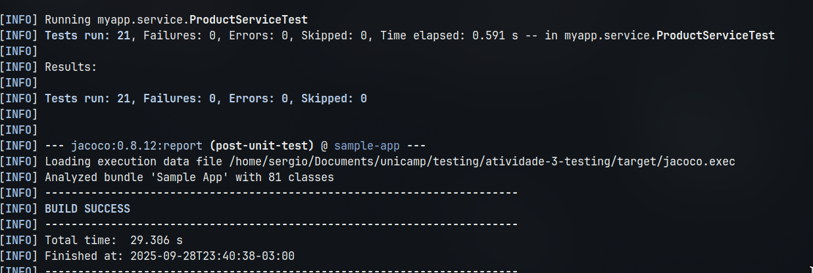

# Análise de Testes de Software - Loja Online


| Nome                              | RA      |
|------------------------------------|---------|
| Sergio Sebastian Pezo Jimenez      | 298813  |
| João Victor Costa Vaccari          | 298794  |
| Gabriel Eduardo Mangione Mamonde   | 298792  |


Este repositório contém os testes de unidade para a entidade `Product`

## Metodologia de Teste (AAA)

Os testes foram estruturados utilizando o padrão **AAA (Arrange, Act, Assert)**, uma abordagem que organiza os testes de unidade de forma clara e concisa.

-   **Arrange (Organizar):** Nesta primeira fase, todo o cenário de teste é preparado. Isso inclui a inicialização de objetos, a configuração de mocks e a definição dos dados de entrada necessários para o teste. O objetivo é criar um ambiente controlado e previsível.
-   **Act (Agir):** Na segunda fase, o método ou a funcionalidade que está sendo testada é executado. Esta é a ação principal do teste, onde o comportamento do sistema é invocado com os dados preparados na fase de *Arrange*.
-   **Assert (Verificar):** Na última fase, os resultados da ação são verificados. As asserções validam se o comportamento do sistema corresponde ao esperado, comparando os resultados obtidos com os valores esperados. Se a verificação falhar, o teste falha.

## Casos de Teste Implementados

A seguir, uma descrição detalhada de cada caso de teste implementado em `ProductServiceTest.java`, com base na análise de classes de equivalência documentada no arquivo `test_cases_coverage.html`.

### Casos de Teste Válidos

Estes testes verificam se a entidade `Product` aceita combinações de dados que são consideradas válidas de acordo com as regras de negócio.

-   **TC1 (testProductValidation\_TC1\_ValidCase):**
    -   **Objetivo:** Validar um produto com todos os campos obrigatórios preenchidos corretamente e um campo opcional (`description`) como nulo.
-   **TC2 (testProductValidation\_TC2\_ValidCase):**
    -   **Objetivo:** Validar um produto com uma descrição no limite inferior de caracteres (50) e com o status `OUT_OF_STOCK`.
-   **TC3 (testProductValidation\_TC3\_ValidCase):**
    -   **Objetivo:** Validar um produto com uma descrição logo acima do limite inferior (51 caracteres) e com o status `PREORDER`.
-   **TC4 (testProductValidation\_TC4\_ValidCase):**
    -   **Objetivo:** Validar um produto com uma descrição próxima ao limite inferior (52 caracteres) e com o status `DISCONTINUED`.

### Casos de Teste Inválidos

Estes testes verificam se a entidade `Product` rejeita dados que violam as regras de validação definidas.

-   **TC5 (testProductValidation\_TC5\_TitleTooShort):**
    -   **Objetivo:** Garantir que um título com menos de 3 caracteres seja rejeitado.
-   **TC6 (testProductValidation\_TC6\_TitleTooLong):**
    -   **Objetivo:** Garantir que um título com mais de 100 caracteres seja rejeitado.
-   **TC7 (testProductValidation\_TC7\_KeywordsTooLong):**
    -   **Objetivo:** Garantir que o campo de palavras-chave com mais de 200 caracteres seja rejeitado.
-   **TC8 (testProductValidation\_TC8\_DescriptionTooShort):**
    -   **Objetivo:** Garantir que uma descrição com menos de 50 caracteres seja rejeitada.
-   **TC9 (testProductValidation\_TC9\_RatingTooLow):**
    -   **Objetivo:** Garantir que uma avaliação (`rating`) menor que 1 seja rejeitada.
-   **TC10 (testProductValidation\_TC10\_RatingTooHigh):**
    -   **Objetivo:** Garantir que uma avaliação maior que 10 seja rejeitada.
-   **TC11 (testProductValidation\_TC11\_PriceTooLow):**
    -   **Objetivo:** Garantir que um preço (`price`) menor que 1 seja rejeitado.
-   **TC12 (testProductValidation\_TC12\_PriceTooHigh):**
    -   **Objetivo:** Garantir que um preço maior que 9999 seja rejeitado.
-   **TC13 (testProductValidation\_TC13\_StockTooLow):**
    -   **Objetivo:** Garantir que uma quantidade em estoque (`quantityInStock`) negativa seja rejeitada.
-   **TC14 (testProductValidation\_TC14\_StatusIsNull):**
    -   **Objetivo:** Garantir que um status nulo seja rejeitado.
-   **TC15 (testProductValidation\_TC15\_WeightIsNegative):**
    -   **Objetivo:** Garantir que um peso (`weight`) negativo seja rejeitado.
-   **TC16 (testProductValidation\_TC16\_DimensionsTooLong):**
    -   **Objetivo:** Garantir que o campo de dimensões com mais de 50 caracteres seja rejeitado.
-   **TC17 (testProductValidation\_TC17\_DateAddedInFuture):**
    -   **Objetivo:** Expor a falta de validação que impede o cadastro de um produto com data de adição no futuro. **Este teste foi projetado para falhar.**
-   **TC18 (testProductValidation\_TC18\_DateAddedTooOld):**
    -   **Objetivo:** Expor a falta de uma regra de negócio que impeça o cadastro de produtos com datas muito antigas. **Este teste foi projetado para falhar.**
-   **TC19 (testProductValidation\_TC19\_DateAddedIsNull):**
    -   **Objetivo:** Garantir que uma data de adição nula seja rejeitada, confirmando que a anotação `@NotNull` está funcionando.
-   **TC20 (testProductValidation\_TC20\_DateModifiedInFuture):**
    -   **Objetivo:** Expor a falta de validação que impede o uso de uma data de modificação no futuro. **Este teste foi projetado para falhar.**
-   **TC21 (testProductValidation\_TC21\_DateModifiedBeforeDateAdded):**
    -   **Objetivo:** Expor a falta de uma validação cruzada que garanta que a data de modificação seja sempre posterior à data de adição. **Este teste foi projetado para falhar.**

> **Nota Importante sobre os Testes de Data:**
> Os casos de teste TC17, TC18, TC20 e TC21 foram intencionalmente desenhados para **passar com sucesso** e, assim, evidenciar a ausência de regras de validação cruciais na entidade `Product`. Eles utilizam a asserção `assertTrue(violations.isEmpty())`, que só é bem-sucedida se o validador **não encontrar nenhum erro**. Como as validações de regras de negócio (ex: `@PastOrPresent`) não existem no código, o validador não reporta violações, a lista de erros fica vazia e o teste "passa" em verde. Esta é uma técnica para provar e documentar que uma validação específica está em falta no código-fonte.

## Como Executar o Projeto

Para compilar, testar e executar a aplicação, utilize os seguintes comandos Maven.

1.  **Compilar e Empacotar o Projeto:**
    Este comando limpa o projeto, compila o código e o empacota. É um bom passo para garantir que tudo está configurado corretamente.
    ```bash
    mvn clean install
    ```

2.  **Executar os Testes:**
    Para rodar a suíte de testes de unidade e verificar a lógica da aplicação, execute:
    ```bash
    mvn clean test
    ```

3.  **Executar a Aplicação:**
    Este comando iniciará a aplicação Spring Boot.
    ```bash
    mvn
    ```
    Após a inicialização, a aplicação estará disponível em `http://localhost:8080`.

## Captura de Tela 


